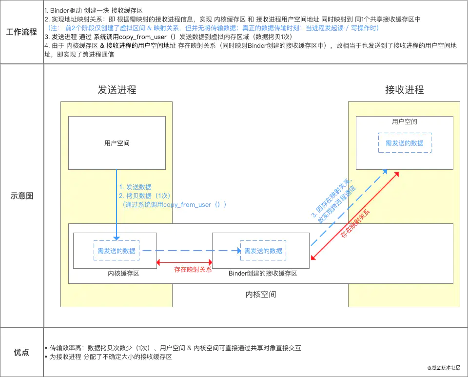

# android 跨进程通信Binder

参考地址： https://zhuanlan.zhihu.com/p/436246818
参考地址： https://blog.csdn.net/qq_30379689/article/details/79451596

## 手写一个跨进程通信 Binder

[代码地址](../examples/app/src/main/java/com/example/project/Binder/)

Binder 是基于 C/S模型


### 先定义实体类

定义需要在跨进程中传输的数据的数据格式

```java
public class Dog implements Parcelable {

    private int gender;
    private String name;

    public Dog(){

    }

    public int getGender() {
        return gender;
    }

    public void setGender(int gender) {
        this.gender = gender;
    }

    public String getName() {
        return name;
    }

    public void setName(String name) {
        this.name = name;
    }

    protected Dog(Parcel in) {
        this.gender = in.readInt();
        this.name = in.readString();
    }

    public static final Creator<Dog> CREATOR = new Creator<Dog>() {
        @Override
        public Dog createFromParcel(Parcel in) {
            return new Dog(in);
        }

        @Override
        public Dog[] newArray(int size) {
            return new Dog[size];
        }
    };

    @Override
    public int describeContents() {
        return 0;
    }

    @Override
    public void writeToParcel(Parcel dest, int flags) {
        dest.writeInt(this.gender);
        dest.writeString(this.name);
    }
}
```

此时实体类一定要实现 Parcelable ，即序列化。


### 定义接口层IInterface
IInterface 是跨进程通信的中，向外提供的功能接口暴露
在这里需要定义Service需要向外暴露的部分

```kotlin
interface IDogManager : IInterface {

    companion object{
        val DESCRIPTOR = "com.example.project.Binder.interfaces.IDogManager"

        val TRANSACTION_getDogList = IBinder.FIRST_CALL_TRANSACTION + 0

        val TRANSACTION_addDog = IBinder.FIRST_CALL_TRANSACTION + 1
    }

    fun getDogList(): List<Dog>

    fun addDog(dog: Dog?)

}
```

* 定义了两个函数API，这两个函数会对 client暴露
  - getDogList 获取数据
  - addDog 添加数据

* 定义了三个静态常量：
  - DESCRIPTOR  标识符
  - TRANSACTION_getDogList  代表调用 getDogList 函数的code
  - TRANSACTION_addDog   代表调用 addDog 函数的code


> 在跨进程通信中，查看 IInterface 层，就能知道 Service 层对 Client 层暴露的 api。


### Binder层

* 新建类 DogManagerImpl
* 继承Binder
* 实现接口层IInterface
* 新建代理类 Proxy 继承 DogManagerImpl 类
* 提供 asInterface 函数，对 IBinder 实例对象进行转换


#### 1.新建类 DogManagerImpl
```kotlin
abstract class DogManagerImpl{}
```
* 此处新建的是抽象类，也可以不用抽象类，但使用抽象类，可以让Service的逻辑写在自己的代码中，使逻辑更加清晰

#### 2.继承Binder
```
abstract class DogManagerImpl : Binder() {
    init {
        // 相当于注册   
        attachInterface(this, DESCRIPTOR)
    }

    // 将当前对象包装成 IBinder
    override fun asBinder(): IBinder {
        return this
    }

    override fun onTransact(code: Int, data: Parcel, reply: Parcel?, flags: Int): Boolean {
        // 根据code匹配调用对应的函数
        when(code){
            INTERFACE_TRANSACTION -> {
                reply?.writeString(DESCRIPTOR)
                return true
            }

            TRANSACTION_getDogList -> {
                // 获取数据时
                data.enforceInterface(DESCRIPTOR)
                var _result = getDogList()
                reply?.writeNoException()
                // 输出结果
                reply?.writeTypedList(_result)
                return true
            }

            TRANSACTION_addDog -> {
                data.enforceInterface(DESCRIPTOR)
                var _arg0: Dog? = null
                if(data.readInt() != 0) {
                    _arg0 = Dog.CREATOR.createFromParcel(data)
                } else {
                    _arg0 = null
                }
                addDog(_arg0)
                reply?.writeNoException()
                return true
            }

        }
        return super.onTransact(code, data, reply, flags)
    }
}
```


#### 3.实现接口层IInterface
```
abstract class DogManagerImpl : Binder(), IDogManager{}
```
因为 DogManagerImpl 被定义成抽象类，所以此处只需写 实现 IDogManager 即可，无需实现具体函数

#### 4. 新建代理类 Proxy 继承 DogManagerImpl 类

新建一个静态内部类 Proxy 继承 DogManagerImpl

因为 DogManagerImpl 是抽象类，所以还要实现  getDogList 、 addDog 函数

```
companion object {
    class Proxy(var remote: IBinder) : DogManagerImpl() {

        override fun asBinder(): IBinder {
            return remote
        }

        override fun getInterfaceDescriptor(): String {
            return  DESCRIPTOR
        }

        override fun getDogList(): List<Dog> {
            var _data = Parcel.obtain()
            var _reply = Parcel.obtain()
            var _result: java.util.ArrayList<Dog>? = null
            try {
                _data.writeInterfaceToken(DESCRIPTOR)
                remote.transact(TRANSACTION_getDogList,_data,_reply,0)
                _reply.readException()
                _result = _reply.createTypedArrayList(Dog.CREATOR)
                println("proxy getData => ${_result}")
            }catch (e: Exception) {
                e.printStackTrace()
                println("error => ${e.message}")
            }finally {
                _data.recycle()
                _reply.recycle()
            }
            return _result!!.toList()
        }

        override fun addDog(dog: Dog?) {
            var _data = Parcel.obtain()
            var _reply = Parcel.obtain()
            try {
                _data.writeInterfaceToken(DESCRIPTOR)
                if(dog != null) {
                    _data.writeInt(1)
                    dog.writeToParcel(_data,0)
                } else {
                    _data.writeInt(0)
                }
                remote.transact(TRANSACTION_addDog, _data, _reply, 0)
                println("proxy addDog => ${_data}")
                _reply.readException()
            }catch (e: Exception) {
                e.printStackTrace()
            }finally {
                _data.recycle()
                _reply.recycle()
            }
        }

    }
}
```

此处的 Proxy 类其实就是跨进程通信中 会被使用的类


#### 5. 提供 asInterface 函数，对 IBinder 实例对象进行转换

* 在 companion object 代码块中添加一个 静态函数 asInterface


```kotlin
companion object {
    fun asInterface(binder: IBinder):IDogManager? {
        if(binder == null) return null
        var iin = binder.queryLocalInterface(DESCRIPTOR)
        if(iin != null && iin is IDogManager) {
            // 在同一进程时，直接返回对象
            println("在统一进程时，直接返回对象")
            return iin
        }
        // 不在同一进程，返回代理对象
        println("不在同一进程，返回代理对象")
        return Proxy(binder)
    }
}
```
这里可以看出 asInterface 函数功能就是通过 IBinder 实例，转换为对应的接口实例

> 注意此处关于进程的判断
> 当 client 与 service 处于相同进程时，则直接返回该对象
> 当处于不同进程时，返回的是 Proxy 实例


## Service层代码

* 接下来编写 Service 代码
  - 注册一个系统服务Service

```kotlin
class RemoteService: Service() {

    var dogs = ArrayList<Dog>()

    val mBinder = object : DogManagerImpl() {
        override fun getDogList(): List<Dog> {
            println("RemoteService => getDogList: ${dogs}")
            return dogs
        }

        override fun addDog(dog: Dog?) {
            if(dog != null) {
                dogs.add(dog)
            }
        }

    }

    override fun onBind(intent: Intent?): IBinder? {
        return mBinder
    }
}

```

* 在 AndroidManifest.xml 中的配置

```xml
<application>
    <service android:name=".Binder.RemoteService"
            android:process=":remote"
            ></service>
</application>
```

* 注意此处的 android:process=":remote", 这是指定 service 运行进程为 包名 + :remote
> process 用于指定进程名，默认与包名一致


## Binder原理

参考：https://www.jianshu.com/p/4d8f4d8f88b9

基于内存映射 mmap，一次拷贝

1，Binder驱动在内核空间创建一个数据接收缓存区B2；

2，将内核缓存区B1和接收进程地址空间S映射到Binde创建一个物理地址空间B2，实现地址映射；

3，发送方进程通过系统调用 copy_from_user() 将数据 copy 到内核缓存区B1，由于内核缓存区B1和接收进程的地址空间S存在内存映射，因此也就相当于把数据发送到了接收进程的用户空间，这样便完成了一次进程间的通信。




* 多种跨进程通信手段
    - 管道
    - 共享内存
    - 消息队列
    - 信号量
    - Socket
    - Binder

### 为何使用Binder

* 高效
    内存映射、一次拷贝

    管道、队列等需要两次内存拷贝


* 安全
    传统的进程通信方式对于通信双方的身份并没有做出严格的验证，接收方无法获得对方进程可靠的UID/PID(用户ID/进程ID)，只 有在上层协议上进行架设；

* 可以很好的实现Client-Server(CS)架构
    Socket是Client-Server的通信 方式。但是，  Socket主要用于网络间通信以及本机中进程间的低速通信，它的传输效率太低。
