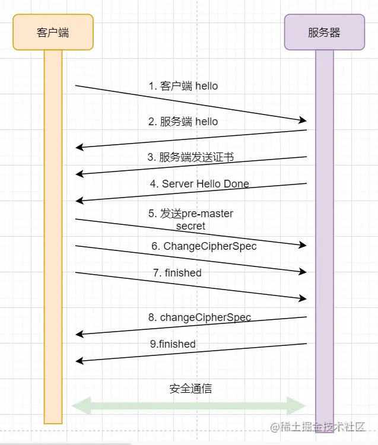
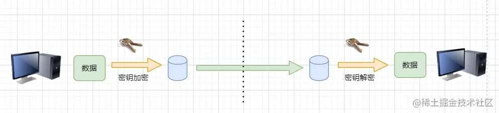
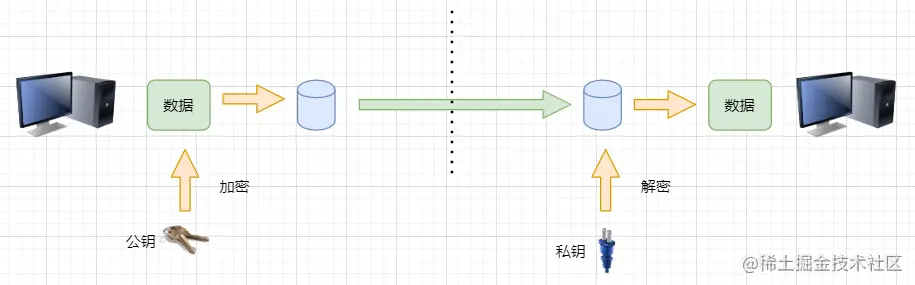
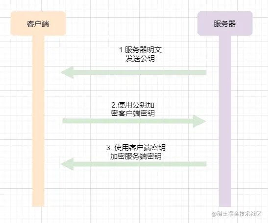

# HTTPS协议详解

参考地址：https://juejin.cn/post/6934678746808975397

* 需要特别注意的是，HTTPS并不是一个新的应用协议来取代HTTP，而是在HTTP的基础上，增加了网络安全的内容。
* HTTPS的全称：Hyper Text Transfer Protocol over SecureSocket Layer，建立在安全socket层次上的超文本传输协议
* 可以认为HTTPS = HTTP+SSL

* HTTPS在HTTP和TCP之间建立了一个安全连接层 。
* SSL/TLS层次和TCP很类似，双方建立TCP连接之后，需要再建立安全连接。
* 与TCP连接一样，SSL连接本质上，是对双方安全信息的记录，并不是一个真正意义上的连接。
* HTTP通过安全连接，即可与目标主机进行安全的通信，不怕被监听、篡改、冒充身份。

> 这里的SSL与TLS指的都是安全协议。SSL全名Secure Sockets Layer，安全套接字层协议；TLS全名Transport Layer Security，安全传输层协议。
> TLS从SSL发展而来，SSL是早期的安全层协议；后期逐渐发现了其安全漏洞，发展出了TLS。
> 
> 此外，建立安全连接是比较消耗性能的。如果每次请求都建立一次安全连接，那么网络的效率将会大打折扣。
> 因此，在建立一次安全连接之后，服务器会存储客户端的安全相关信息，在一定时间内通信时无需再次建立安全连接，服务器会把先前的密钥等信息发送给客户端，直接使用此前已经记录的安全信息即可。

## 加密算法

## 安全连接建立流程

* 和TCP连接类同，安全连接也需要一个建立的流程。

但是经过了前面HTTPS加密算法以及证书体系的学习，理解HTTPS安全连接建立流程就非常简单了。基本就是把上面的流程走了一遍。先来看一张总体图：

### 建立HTTPS连接过程

* 1. 客户端请求服务器建立安全连接，附加客户端支持的SSL与TLS版本、支持的加密算法版本、**随机数**。**(HTTP协议中第一次牵手，并附加客户端信息)**

> 加密算法与安全协议版本有很多，但服务不一定支持最新版本的协议预算法。所以客户端把所以支持的版本发送给服务器，让服务器去选择。
>
>随机数非常重要，前面讲hash算法的时候讲到，随机数是一个动态因子，让hash算法更加安全。同时，随机数也参与了对称密钥的生成。

* 2. 服务器响应请求，附加选择的协议版本、加密算法版本、**服务器随机数**。

>服务器从客户端支持的协议版本中，选择一套自己最喜欢的。
> 
>为了辨别消息是由哪一方加密并发出的，需要准备两个对称密钥。因此服务器也需要产生一个随机数。

* 3. 服务器向客户端发送证书
> 服务器向客户端发送自己证书，其中就包含了服务器的公钥。
>
> **此处获取到了公钥**

* 4. 服务器发送hello done表示hello阶段结束 **(HTTP协议中第二次牵手  )**

* 5. 客户端验证证书，拿到服务器公钥；利用两个随机数，生成pre-master secret，并使用服务器的公钥加密发送给服务器。

> 证书验证步骤参考上面的证书小节；
> pre-master secret是一个非常重要的东西，双方利用pre-master secret生成master-secret，利用前面的两个随机数生成两个对称加密密钥和两个HMAC密钥，两对密钥分别用于客户端加密和服务器加密。
>
> **使用随机数，生成私钥**
> **再使用公钥加密客户端的私钥，发送给服务端**

* 6. 客户端发送changeCipherSpec提示服务器此后使用pre-master secret产生的密钥加密通信

* 7. 客户端发送FIN报文，表示结束 **(HTTP协议中第三次牵手)**

* 8. 服务器也发送changeCipherSpec报文

> **服务端使用客户端的私钥加密服务端的私钥发送给客户端，客户端获取到服务端的私钥**

* 9. 服务器也发送FIN报文，表示结束

* 10. 双方可以开始安全通信了

至此，对于HTTPS的加密流程，已经比较清晰了。

* 在TCP/IP协议的三次牵手基础上，新增了公钥传输 & 私钥生成、交换的过程

上面使用到了**证书 + 对称算法 + 非对称算法**

## 对称算法

对称算法比较简单：加密和解密数据使用相同的密钥 。如下图：

对称算法的优点就是效率很高，可以对长数据进行加解密。但对称算法也存在缺点。

* 双方使用相同的密钥，无法辨别数据到底是由服务器加密还是客户端加密，也就是无法区分一个消息是由服务器发出还是由客户端发出。
  - 解决这个问题方法也很简单：双方加密使用不同的密钥 。

* 通信双方难以确保拿到安全的密钥 。因为第一步总是需要通过网路通信来商量密钥，那可不可以使用固定的密钥？
  前面讲过，黑客也是一个客户，那么他也可以拿到密钥，这个算法就失去意义了。
  - 解决这个问题的方法是：使用非对称算法

## 非对称算法

非对称算法是**加密与解密使用不同的密钥** 。如下图：

* 非对称加密有两把密钥：公钥和私钥
* 公钥可公开给所有人，私钥必须自己保密，不给任何人拿到
* 客户端可以使用服务器的公钥加密数据，而这份密文，只有服务器的私钥才能解开
* 反过来，使用私钥加密的数据，也只有公钥可以解开

非对称算法很好地解决了对称算法存在的问题：**无法安全交换密钥** 。服务器的公钥可以公开给所有的用户，当客户端首次访问服务器，服务器便把公钥返回即可。

但是对于非对称算法有一个很严重的缺点：**性能极差** 。所以我们可以将对称与非对称算法结合起来，解决上述问题

## 对称+非对称

对称算法存在的问题是无法安全地互换密钥；因此第一步我们可以使用非对称算法来交换密钥，后续使用对称算法来进行通信。如下图：

* 当客户访问服务器时，服务器返回一个公钥；
* 客户端拿到公钥之后，对客户端密钥使用公钥进行加密之后发送给服务端；
* 服务端拿到客户端密钥之后对服务端密钥进行加密发送给客户端；

这样就完成了双方密钥的交换，后续可以使用密钥进行高效率通信。

> 到此我们的网络传输依旧不是安全的，因为，我们无法保证第一步服务器返回的公钥不会被黑客篡改。
> 假如黑客把服务器返回的公钥转换成自己的公钥，后续他就可以对客户端的的所有消息使用自己的私钥解密。
> 而问题的本质在于：我们无法辨别返回的数据是否是真的由服务器返回的 。
> 这个问题的解决方法就是：**使用数字证书来证明信息发送方的身份** 。

## 数字证书
