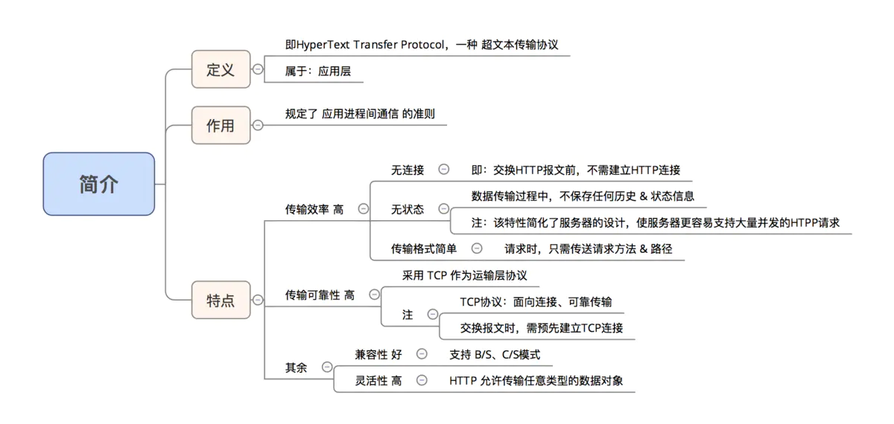
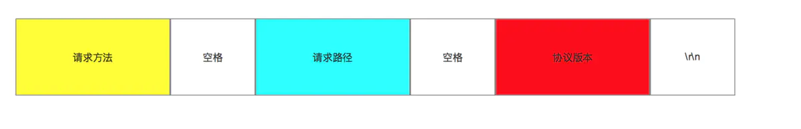
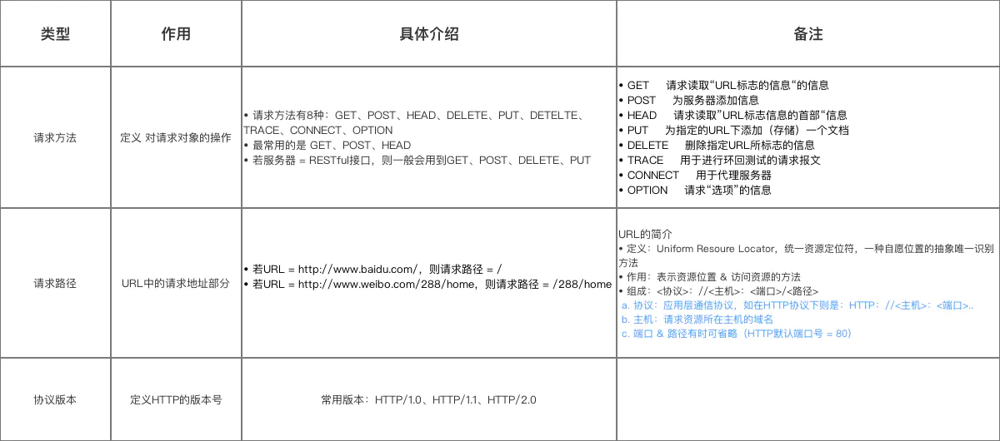
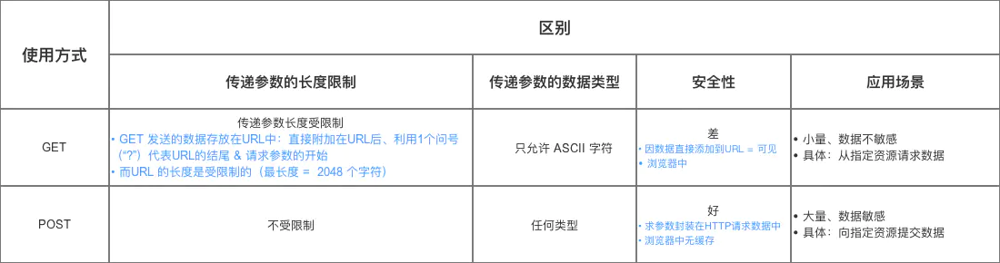
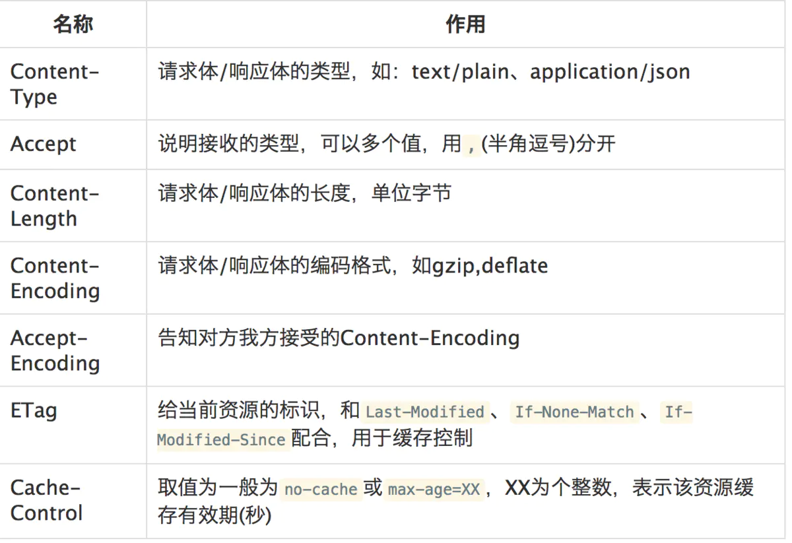
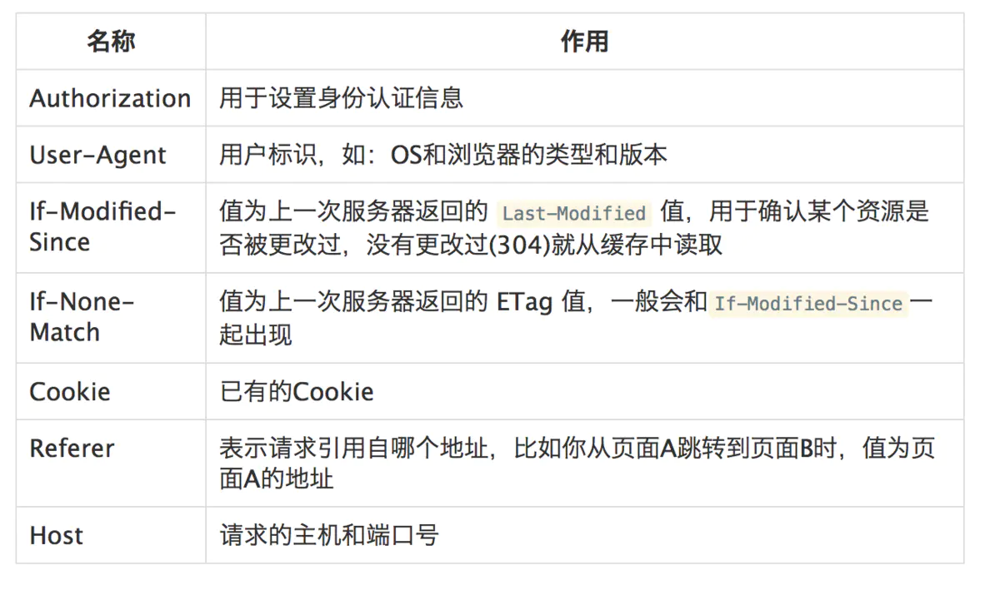
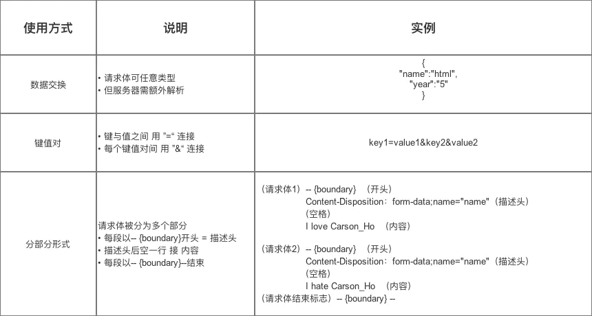
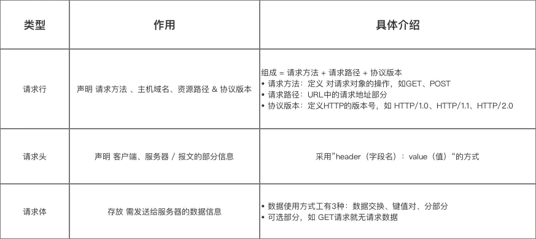
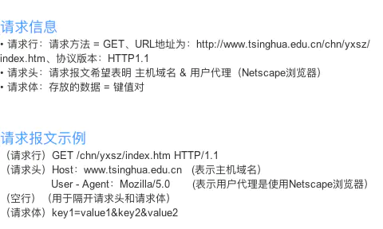

# HTTP 协议详解

* HTTP: HyperText Transfer Protocol,超文本传输协议，属于应用层

参考地址：https://www.jianshu.com/p/a6d086a3997d

## 1.简介

## 2.工作方式

* HTTP协议采用 请求 / 响应 的工作方式

## 3.HTTP报文详解

* HTTP在 应用层 交互数据的方式 = 报文
* HTTP的报文分为：请求报文 & 响应报文
> 分别用于 发送请求 & 响应请求时

### 3.1 请求报文

#### 3.1.1 报文结构

* HTTP的请求报文由 请求行、请求头 & 请求体 组成，如下图

#### 3.1.2 结构详细介绍
**组成1：请求行**
  - 作用：声明 请求方法 、主机域名、资源路径 & 协议版本
  - 结构：请求行的组成 = 请求方法 + 请求路径 + 协议版本
> 注：空格不能省

> 此处特意说明GET、PSOT方法的区别：

* 示例: 设：请求报文采用GET方法、 URL地址 = http://www.tsinghua.edu.cn/chn/yxsz/index.htm；、HTTP1.1版本
  - 则请求行是：GET /chn/yxsz/index.htm HTTP/1.1

**组成2：请求头**

* 作用：声明 客户端、服务器 / 报文的部分信息
* 使用方式：采用”header（字段名）：value（值）“的方式
* 常用请求头
**1. 请求和响应报文的通用Header**

**2. 常见请求Header**

* 举例：
(URL地址：http://www.tsinghua.edu.cn/chn/yxsz/index.htm）
Host：www.tsinghua.edu.cn (表示主机域名）
User - Agent：Mozilla/5.0 (表示用户代理是使用Netscape浏览器）

**组成3：请求体**

* 作用：存放 需发送给服务器的数据信息
> 可选部分，如 GET请求就无请求数据

* 使用方式：共3种

* 至此，关于请求报文的请求行、请求头、请求体 均讲解完毕。

#### 3.1.3 总结

* 关于 请求报文的总结如下

* 请求报文示例

