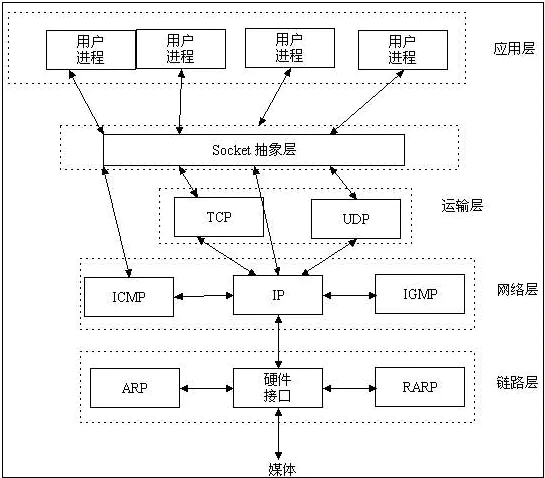
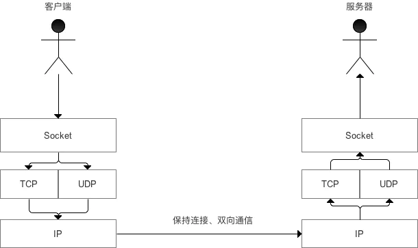
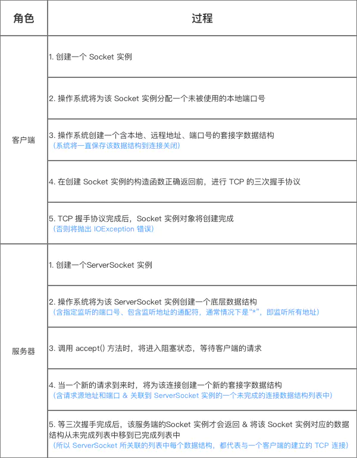

# Socket详解

* Socket在网络通信中扮演及其重要的角色

## 1、定义

* 即套接字，是应用层 与 TCP/IP 协议族通信的中间软件抽象层，表现为一个封装了 TCP / IP协议族 的编程接口（API）




> Socket不是一种协议，而是一个编程调用接口（API），属于传输层（主要解决数据如何在网络中传输）
> 即：通过Socket，我们才能在Andorid平台上通过 TCP/IP协议进行开发
> 对用户来说，只需调用Socket去组织数据，以符合指定的协议，即可通信

* 成对出现，一对套接字：

```java
Socket ={(IP地址1:PORT端口号)，(IP地址2:PORT端口号)\}
```

* 一个 Socket 实例 唯一代表一个主机上的一个应用程序的通信链路

## 2、原理

Socket的使用类型主要有两种：

* 流套接字（streamsocket） ：基于 TCP协议，采用 流的方式 提供可靠的字节流服务
* 数据报套接字(datagramsocket)：基于 UDP协议，采用 数据报文 提供数据打包发送的服务

具体原理图如下：



## 3、Socket建立连接过程



## 4、Socket 与 Http 对比

* Socket属于传输层，因为 TCP / IP协议属于传输层，解决的是数据如何在网络中传输的问题
* HTTP协议 属于 应用层，解决的是如何包装数据


由于二者不属于同一层面，所以本来是没有可比性的。但随着发展，默认的Http里封装了下面几层的使用，
所以才会出现Socket & HTTP协议的对比：（主要是工作方式的不同）：

* Http：采用 请求—响应 方式。

> * 即建立网络连接后，当 客户端 向 服务器 发送请求后，服务器端才能向客户端返回数据。
> * 可理解为：是客户端有需要才进行通信

* Socket：采用 服务器主动发送数据 的方式

> * 即建立网络连接后，服务器可主动发送消息给客户端，而不需要由客户端向服务器发送请求
> * 可理解为：是服务器端有需要才进行通信

5.使用

* Socket可基于TCP或者UDP协议，但TCP更加常用
* 所以下面的使用步骤 & 实例的Socket将基于TCP协议

在客户端使用示例：https://github.com/wangchongwei/JetpackLearn/tree/master/app/src/main/java/com/justin/jetpacklearn/socket


## Socket源码解读

### 建立连接过程

当Socket实例创建完毕时，TCP三次握手就已完成，代表实例已创建。


客户端创建实例：
```kotlin
socket = Socket("192.168.101.130", 3333)
```

* 看一下Socket构造函数

```java
public Socket(String host, int port)
        throws UnknownHostException, IOException
    {
        // Android-changed: App compat. Socket ctor should try all addresses. http://b/30007735
        this(InetAddress.getAllByName(host), port, (SocketAddress) null, true);
    }
```

这里会把传入的主机域名解析成 ip地址集合，然后调用另一个构造函数

```java
private Socket(InetAddress[] addresses, int port, SocketAddress localAddr,
            boolean stream) throws IOException {
        if (addresses == null || addresses.length == 0) {
          // 当ip解析为空时，抛出异常
            throw new SocketException("Impossible: empty address list");
        }

        for (int i = 0; i < addresses.length; i++) {
            setImpl();
            try {
                InetSocketAddress address = new InetSocketAddress(addresses[i], port);
                createImpl(stream);
                if (localAddr != null) {
                    bind(localAddr);
                }
                connect(address);
                break;
            } catch (IOException | IllegalArgumentException | SecurityException e) {
                try {
                    // Android-changed: Let ctor call impl.close() instead of overridable close().
                    // Subclasses may not expect a call to close() coming from this constructor.
                    impl.close();
                    closed = true;
                } catch (IOException ce) {
                    e.addSuppressed(ce);
                }

                // Only stop on the last address.
                if (i == addresses.length - 1) {
                    throw e;
                }
            }

            // Discard the connection state and try again.
            impl = null;
            created = false;
            bound = false;
            closed = false;
        }
    }
```

可以看到，在此处的逻辑中，最主要只有如下四个函数

* setImpl()
* createImpl(stream)
* bind(localAddr)
* connect(address)

再对以上四个函数进行逐一分析

先看一下 SocketImpl 及其子类的UML类图


#### setImpl


```java
void setImpl() {
    if (factory != null) {
        impl = factory.createSocketImpl();
        checkOldImpl();
    } else {
        // No need to do a checkOldImpl() here, we know it's an up to date
        // SocketImpl!
        impl = new SocksSocketImpl();
    }
    if (impl != null)
        impl.setSocket(this);
}
```
factory 默认为空，除非 通过调用 setSocketImplFactory 手动实现自己的 SocketImplFactory

所以此处的 impl = new SocksSocketImpl();

#### createImpl(stream)

```java
void createImpl(boolean stream) throws SocketException {
    if (impl == null)
        setImpl();
    try {
        impl.create(stream);
        created = true;
    } catch (IOException e) {
        throw new SocketException(e.getMessage());
    }
}
```

上面说了  impl = new SocksSocketImpl();
但 SocksSocketImpl 中并没有实现 create 函数， SocksSocketImpl 是继承自 PlainSocketImpl，而 PlainSocketImpl，而 中也没有实现 create 函数,
而 PlainSocketImpl 又是继承自 AbstractPlainSocketImpl

也就是说最终是调用的 AbstractPlainSocketImpl 中的 create

* AbstractPlainSocketImpl create
```java

// stream = true
protected synchronized void create(boolean stream) throws IOException {
        this.stream = stream;
        if (!stream) {
            ResourceManager.beforeUdpCreate();
            // Android-removed: socketCreate should set fd if it succeeds.
            // fd = new FileDescriptor();
            try {
                socketCreate(false);
            } catch (IOException ioe) {
                ResourceManager.afterUdpClose();
                // Android-changed: Closed sockets use an invalid fd, not null. b/26470377
                // fd = null;
                throw ioe;
            }
        } else {
            // Android-removed: socketCreate should set fd if it succeeds.
            // fd = new FileDescriptor();
            socketCreate(true);
        }
        if (socket != null)
            socket.setCreated();
        if (serverSocket != null)
            serverSocket.setCreated();

        // Android-added: CloseGuard.
        if (fd != null && fd.valid()) {
            guard.open("close");
        }
    }
```

此处会调用 socketCreate 但 该函数是一个抽象函数，查看子类是否有实现，
* 在   类中，实现了该函数

```java
void socketCreate(boolean isStream) throws IOException {
        // The fd object must not change after calling bind, because we rely on this undocumented
        // behaviour. See libcore.java.net.SocketTest#testFileDescriptorStaysSame.
        fd.setInt$(IoBridge.socket(AF_INET6, isStream ? SOCK_STREAM : SOCK_DGRAM, 0).getInt$());
        IoUtils.setFdOwner(fd, this);

        if (serverSocket != null) {
            IoUtils.setBlocking(fd, false);
            IoBridge.setSocketOption(fd, SO_REUSEADDR, true);
        }
    }
```

* 上次的调用还只是 生成一个 SocketImpl 的实例对象
* 接下来查看 bind 函数

#### bind

```java
public void bind(SocketAddress bindpoint) throws IOException {
        if (isClosed())
            throw new SocketException("Socket is closed");
        if (!oldImpl && isBound())
            throw new SocketException("Already bound");

        if (bindpoint != null && (!(bindpoint instanceof InetSocketAddress)))
            throw new IllegalArgumentException("Unsupported address type");
        InetSocketAddress epoint = (InetSocketAddress) bindpoint;
        if (epoint != null && epoint.isUnresolved())
            throw new SocketException("Unresolved address");
        if (epoint == null) {
            epoint = new InetSocketAddress(0);
        }
        InetAddress addr = epoint.getAddress();
        int port = epoint.getPort();
        checkAddress (addr, "bind");
        SecurityManager security = System.getSecurityManager();
        if (security != null) {
            security.checkListen(port);
        }
        getImpl().bind (addr, port);
        bound = true;
    }
```
getImpl().bind (addr, port); 
也就是说最终会调用到 AbstractPlainSocketImpl 中的 bind 函数

```java
protected synchronized void bind(InetAddress address, int lport)
        throws IOException
    {
       synchronized (fdLock) {
            if (!closePending && (socket == null || !socket.isBound())) {
                NetHooks.beforeTcpBind(fd, address, lport);
            }
        }
        socketBind(address, lport);
        if (socket != null)
            socket.setBound();
        if (serverSocket != null)
            serverSocket.setBound();
    }
```

与 create 函数类似，此处也会调用一个抽象函数， socketBind(address, lport); 该函数的实现在 PlainSocketImpl 类中

```java
// PlainSocketImpl
void socketBind(InetAddress address, int port) throws IOException {
        if (fd == null || !fd.valid()) {
            throw new SocketException("Socket closed");
        }

        IoBridge.bind(fd, address, port);

        this.address = address;
        if (port == 0) {
            // Now that we're a connected socket, let's extract the port number that the system
            // chose for us and store it in the Socket object.
            localport = IoBridge.getLocalInetSocketAddress(fd).getPort();
        } else {
            localport = port;
        }
    }
```

bind 函数的主要作用应该是 绑定 地址、端口、fd(FileDescriptor)

#### connect

connect 过程代表的是 TCP 建立连接过程中的 **第一次握手**

```java
public void connect(SocketAddress endpoint) throws IOException {
        connect(endpoint, 0);
    }

public void connect(SocketAddress endpoint, int timeout) throws IOException {
        if (endpoint == null)
            throw new IllegalArgumentException("connect: The address can't be null");

        if (timeout < 0)
          throw new IllegalArgumentException("connect: timeout can't be negative");

        if (isClosed())
            throw new SocketException("Socket is closed");

        if (!oldImpl && isConnected())
            throw new SocketException("already connected");

        if (!(endpoint instanceof InetSocketAddress))
            throw new IllegalArgumentException("Unsupported address type");

        InetSocketAddress epoint = (InetSocketAddress) endpoint;
        InetAddress addr = epoint.getAddress ();
        int port = epoint.getPort();
        checkAddress(addr, "connect");

        SecurityManager security = System.getSecurityManager();
        if (security != null) {
            if (epoint.isUnresolved())
                security.checkConnect(epoint.getHostName(), port);
            else
                security.checkConnect(addr.getHostAddress(), port);
        }
        if (!created)
            createImpl(true);
        if (!oldImpl)
            impl.connect(epoint, timeout);
        else if (timeout == 0) {
            if (epoint.isUnresolved())
                impl.connect(addr.getHostName(), port);
            else
                impl.connect(addr, port);
        } else
            throw new UnsupportedOperationException("SocketImpl.connect(addr, timeout)");
        connected = true;
        /*
         * If the socket was not bound before the connect, it is now because
         * the kernel will have picked an ephemeral port & a local address
         */
        bound = true;
    }
```

此处会调用  impl.connect(addr, port); 最终实现在 AbstractPlainSocketImpl 类中

```java
protected void connect(String host, int port)
        throws UnknownHostException, IOException
    {
        boolean connected = false;
        try {
            InetAddress address = InetAddress.getByName(host);
            this.port = port;
            this.address = address;

            connectToAddress(address, port, timeout);
            connected = true;
        } finally {
            if (!connected) {
                try {
                    close();
                } catch (IOException ioe) {
                    /* Do nothing. If connect threw an exception then
                       it will be passed up the call stack */
                }
            }
        }
    }


private void connectToAddress(InetAddress address, int port, int timeout) throws IOException {
        if (address.isAnyLocalAddress()) {
            doConnect(InetAddress.getLocalHost(), port, timeout);
        } else {
            doConnect(address, port, timeout);
        }
    }

synchronized void doConnect(InetAddress address, int port, int timeout) throws IOException {
        synchronized (fdLock) {
            if (!closePending && (socket == null || !socket.isBound())) {
                NetHooks.beforeTcpConnect(fd, address, port);
            }
        }
        try {
            acquireFD();
            try {
                // Android-added: BlockGuard.
                BlockGuard.getThreadPolicy().onNetwork();
                socketConnect(address, port, timeout);
                /* socket may have been closed during poll/select */
                synchronized (fdLock) {
                    if (closePending) {
                        throw new SocketException ("Socket closed");
                    }
                }
                // If we have a ref. to the Socket, then sets the flags
                // created, bound & connected to true.
                // This is normally done in Socket.connect() but some
                // subclasses of Socket may call impl.connect() directly!
                if (socket != null) {
                    socket.setBound();
                    socket.setConnected();
                }
            } finally {
                releaseFD();
            }
        } catch (IOException e) {
            close();
            throw e;
        }
    }

```
会调用到 socketConnect 函数， 该函数又是抽象函数， 会调用到 PlainSocketImpl 中的 socketConnect

```java
void socketConnect(InetAddress address, int port, int timeout) throws IOException {
        if (fd == null || !fd.valid()) {
            throw new SocketException("Socket closed");
        }

        IoBridge.connect(fd, address, port, timeout);

        this.address = address;
        this.port = port;

        if (localport == 0) {
            // If socket is pending close, fd becomes an AF_UNIX socket and calling
            // getLocalInetSocketAddress will fail.
            // http://b/34645743
            if (!isClosedOrPending()) {
                localport = IoBridge.getLocalInetSocketAddress(fd).getPort();
            }
        }
    }
```

此时，TCP连接中第一次握手完成，会发送一个  **连接请求** 报文段到服务端，报文段中首部信息：SYN = 1， 并随机一个起始序号 x， seq = x；不携带数据， 客户端进入 SYN_SENT  状态


## ServerSocket

ServerSocket 是服务端 Socket

listen() 是服务端的监听，代表 tcp连接过程中的第二次牵手

accept() 代表是 tcp连接过程中的第三次牵手，也是服务端触发


