# TCP协议详解

参考地址：https://www.jianshu.com/p/65605622234b

## 1.定义

Transmission Control Protocol，即 传输控制协议

> * 属于 传输层通信协议
> * 基于TCP的应用层协议有HTTP、SMTP、FTP、Telnet 和 POP3

位于TCP/IP协议体系结构中的第三层 传输层

## 2.特点

* 面向连接
  - 使用TCP协议传输数据前，必须先建立TCP连接
* 全双工通信
  - 通信双方都可以发送数据
* 可靠
  - 不丢失、无差错、不重复、按序到达
* 面向字节流
  - 一次传输的报文段有长度限制，可分块、分次传输

## 3.优缺点
* 优点： 可靠，不丢失
* 缺点： 效率低，因为每次使用都要建立连接

## 4.报文段格式

* TCP虽面向字节流，但传送的数据单元 = 报文段
* 报文段 = 首部 + 数据 2部分
* TCP的全部功能体现在它首部中各字段的作用，故下面主要讲解TCP报文段的首部

> 首部前20个字符固定、后面有4n个字节是根据需而增加的选项 
> 故 TCP首部最小长度 = 20字节

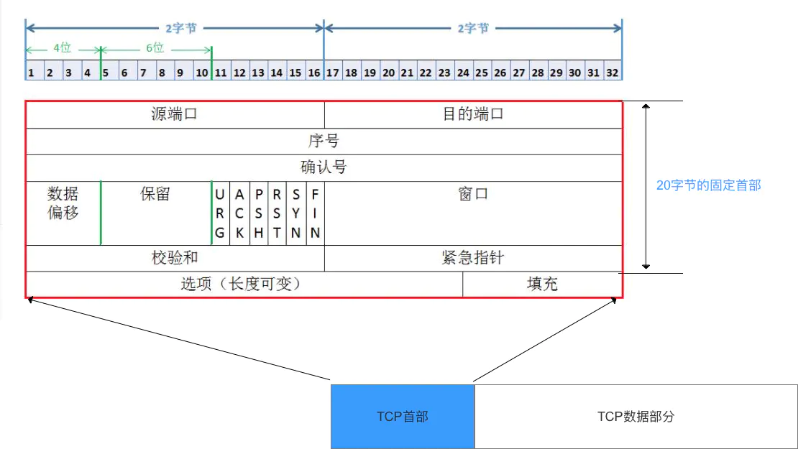

## 5.TCP连接建立过程

* TCP协议建立需要经过 三次握手
  - 第一次握手：客户端发送一个 **连接请求** 报文段到服务端，报文段中首部信息：SYN = 1， 并随机一个起始序号 x， seq = x；不携带数据， 客户端进入 SYN_SENT  状态
  - 第二次握手：服务端接收到连接请求报文段，，也向客户端发送一个 **连接确认** 的报文段，报文段中首部信息：SYN = 1，ACK = 1，并随机一个起始序号 y， seq = y，确认号字段，ack = x + 1；不携带数据，服务端进入 SYN_RCVD 状态
  - 第三次握手：客户端收到服务端发送的连接确认报文段，再向服务端发送一个 **连接确认** 的报文段，报文段首部信息：ACK = 1，seq = x + 1， ack = y + 1，因无SYN = 1，此报文段可携带数据.此时，客户端与服务端都进入ESTABLISHED状态

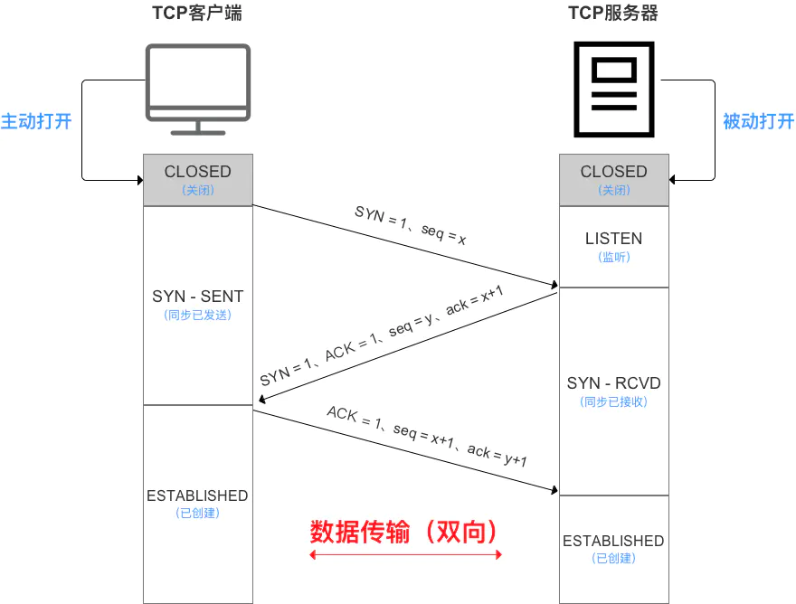

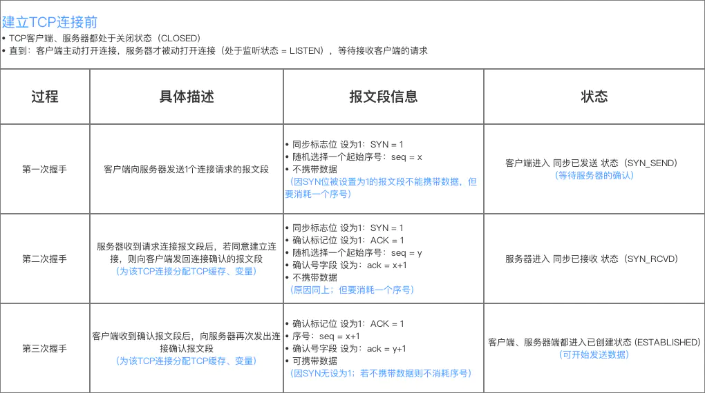

**成功进行TCP的三次握手后，就建立起一条TCP连接，即可传送应用层数据** 

> * 因 TCP提供的是全双工通信，故通信双方的应用进程在任何时候都能发送数据
> * 三次握手期间，任何1次未收到对面的回复，则都会重发

### 特别说明：为什么TCP建立连接需三次握手？

* answer:
  - 防止服务器端因接收了早已失效的连接请求报文，从而一直等待客户端请求，最终导致形成死锁、浪费资源

* 具体描述

> SYN洪泛攻击：
> 
> 从上可看出：服务端的TCP资源分配时刻 = 完成第二次握手时；而客户端的TCP资源分配时刻 = 完成第三次握手时 
> 这就使得服务器易于受到SYN洪泛攻击，即同时多个客户端发起连接请求，从而需进行多个请求的TCP连接资源分配 

## 6.释放连接过程

在通信结束后，需要释放TCP连接，需经历四次挥手过程，才能断开连接

### 四次挥手
  - 第一次挥手，客户端向服务端发送一个 **释放连接** 的报文段，报文段信息：FIN = 1，seq = u，客户端进入 FIN_WAIT_1 状态
  - 第二次挥手，服务端收到客户端发送的释放连接的请求报文，向客户端发送一个 **连接释放确认** 报文段，报文段信息： ACK = 1，seq = v，ack = u + 1， 服务端进入 CLOSE_WAIT 状态。
    此时，客户端 -> 服务端的连接已断开，TCP连接处于半关闭状态
  - 第三次挥手，服务端向客户端再发送一个 **释放连接** 的报文段，报文段信息：FIN= 1， ACK = 1，seq = w，ack = u + 1；服务端进入 LAST_ACK 状态
  - 第四次挥手，客户端接收到服务端发送的释放连接报文，再向服务端发送一个 **连接释放确认** 报文段，报文段信息： ACK = 1，seq = u + 1，ack = w + 1。
    此时客户端进入 TIME_WAIT 状态，服务端进入 CLOSED 状态，此时TCP还未断开，需经过时间等待计时器设置的时间2MSL后，客户端才进入 CLOSED 状态，即服务端比客户端先关闭

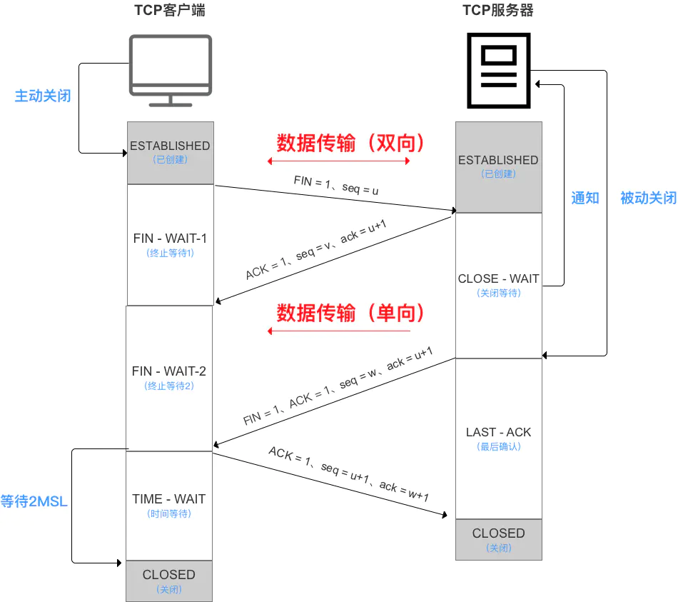
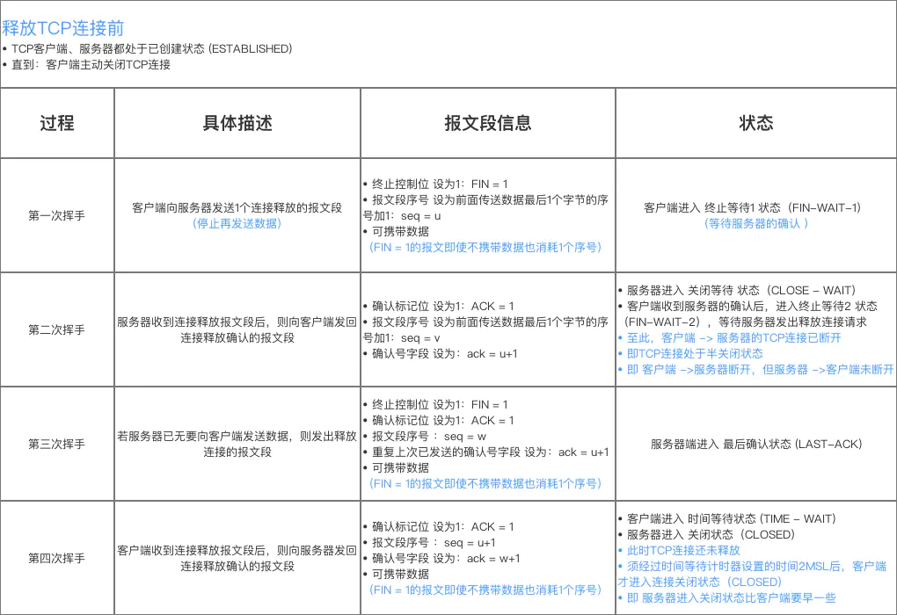

### 特别说明：为什么TCP释放连接需四次挥手？

* 结论
  - 为了保证通信双方都能通知对方 需释放 & 断开连接
> 即释放连接后，都无法接收 / 发送消息给对方

* 具体描述
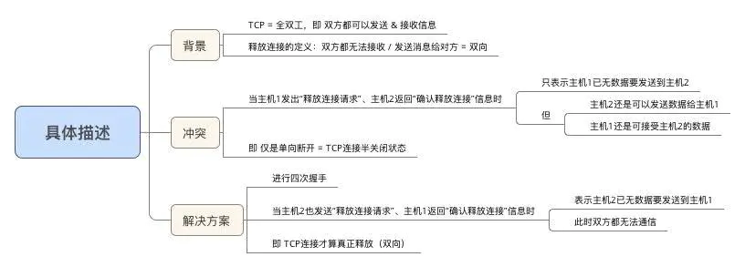

> 延伸疑问：为什么客户端关闭连接前要等待2MSL时间？
>
> 即 TIME - WAIT 状态的作用是什么；
> MSL = 最长报文段寿命（Maximum Segment Lifetime）

* 原因1：为了保证客户端发送的最后1个连接释放确认报文 能到达服务器，从而使得服务器能正常释放连接

* 原因2：防止 上文提到的早已失效的连接请求报文 出现在本连接中客户端发送了最后1个连接释放请求确认报文后，再经过2MSL时间，则可使本连接持续时间内所产生的所有报文段都从网络中消失

> 即 在下1个新的连接中就不会出现早已失效的连接请求报文

## 7.无差错传输

* 对比于UDP，TCP的传输是可靠的、无差错的
* 那么，为什么TCP的传输为什么是可靠的、无差错的呢？
* 下面，我将详细讲解TCP协议的无差错传输

### 含义

* 无差错：即 传输信道不出差错
* 发送 & 接收效率匹配：即 无论发送方以多快的速度发送数据，接收方总来得及处理收到的数据

### 基础：滑动窗口 协议

* 先理解2个基础概念：发送窗口、接收窗口

* 工作原理
  - 对于发送端：
    * 1、每收到一个确认帧，发送窗口就向前滑动一个帧的距离
    * 2、当发送窗口内无可发送的帧时（即窗口内的帧全部是已发送但未收到确认的帧），发送方就会停止发送，直到收到接收方发送的确认帧使窗口移动，窗口内有可以发送的帧，之后才开始继续发送

具体如下图：

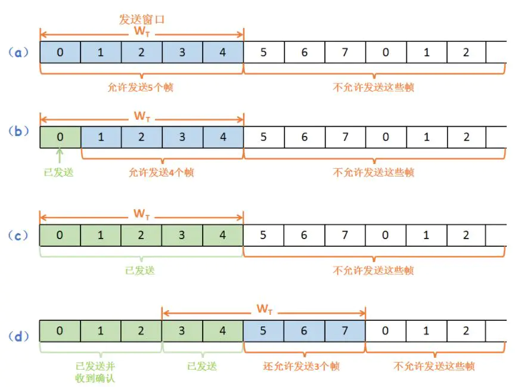

只有收到服务端发送的确认帧，才会继续发送数据帧，否则停止发送

* 对于接收端：当收到数据帧后，将窗口向前移动一个位置，并发回确认帧，若收到的数据帧落在接收窗口之外，则一律丢弃。

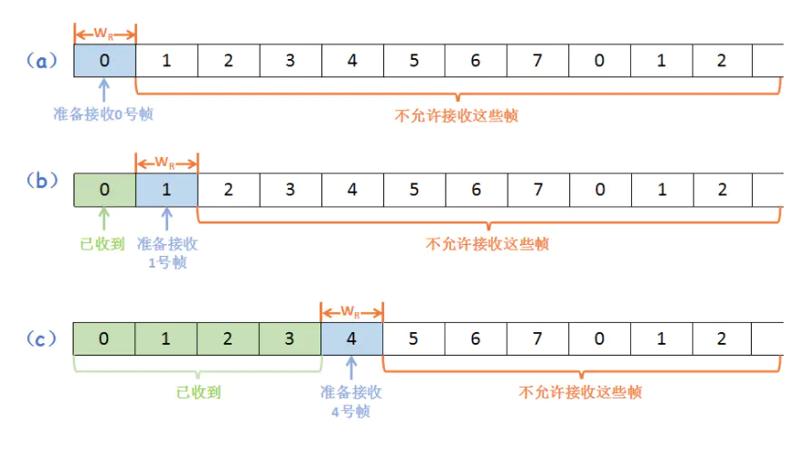

也就是说，只有确保当前的数据帧是准确位置窗口的，否则丢弃

* 总的流程：
  - 1、客户端向服务端发送数据帧
  - 2、服务端接收数据帧，并判断该数据帧是否属于当前接收窗口，如果不是，则丢弃该数据帧。如果是，则放入该接收窗口，并右移，然后向客户端发送确认帧
  - 3、客户端接收到确认帧，并检查发出的数据帧是否都收到确认帧，如果没有，则等待接收确认帧。如果都收到确认帧，则又从第1步开始。

### 滑动窗口 协议的重要特性

* 只有接收窗口向前滑动、接收方发送了确认帧时，发送窗口才有可能（只有发送方收到确认帧才是一定）向前滑动
* 停止-等待协议、后退N帧协议 & 选择重传协议只是在发送窗口大小和接收窗口大小上有所差别：

> 停止等待协议：发送窗口大小=1，接收窗口大小=1；即 单帧滑动窗口 等于 停止-等待协议
> 后退N帧协议：发送窗口大小>1，接收窗口大小=1。
> 选择重传协议：发送窗口大小>1，接收窗口大小>1。

* 当接收窗口的大小为1时，可保证帧有序接收。
* 数据链路层的滑动窗口协议中，窗口的大小在传输过程中是固定的（注意要与TCP的滑动窗口协议区别）

### 实现无差错传输的解决方案

核心思想：采用一些可靠传输协议，使得 

* 出现差错时，让发送方重传差错数据：即 出错重传
* 当接收方来不及接收收到的数据时，可通知发送方降低发送数据的效率：即 速度匹配

针对上述2个问题，分别采用的解决方案是：自动重传协议 和 流量控制 & 拥塞控制协议

**解决方案1：自动重传请求协议ARQ（针对 出错重传）**

* 定义
  - 即 Auto Repeat reQuest，具体介绍如下：
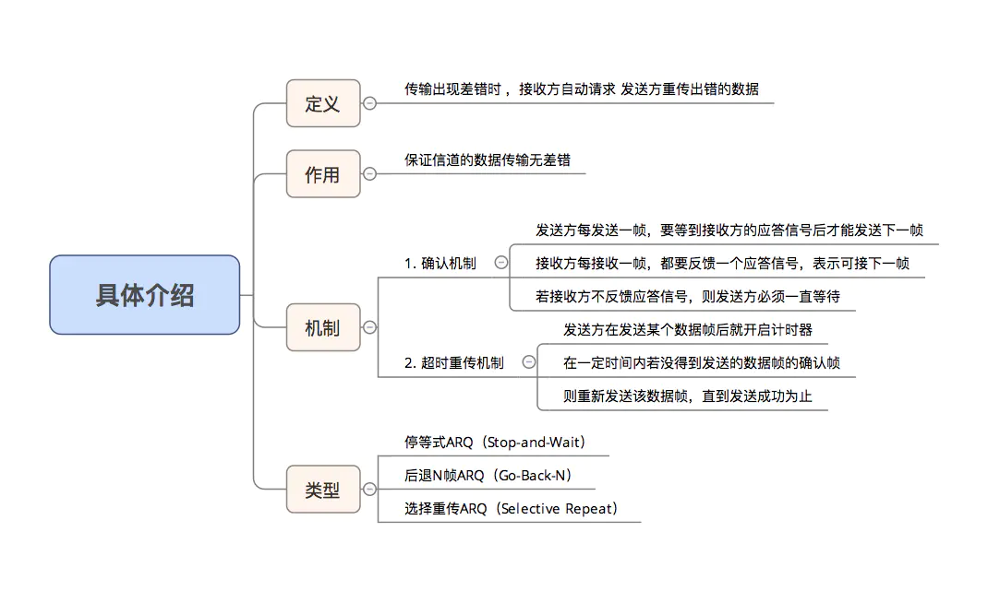

* 类型

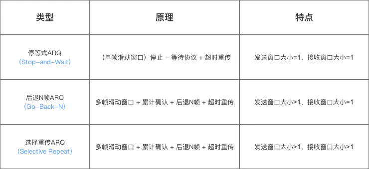

下面，将主要讲解 上述3类协议

*类型1：停等式ARQ（Stop-and-Wait）* 
* 原理：（单帧滑动窗口）停止 - 等待协议 + 超时重传

> 即 ：发送窗口大小=1、接收窗口大小=1

* 停止 - 等待协议的协议原理如下：

> 发送方每发送一帧，要等到接收方的应答信号后才能发送下一帧
> 接收方每接收一帧，都要反馈一个应答信号，表示可接下一帧
> 若接收方不反馈应答信号，则发送方必须一直等待

*类型2：后退N帧协议*
也称：连续ARQ协议

* 原理
  - 多帧滑动窗口 + 累计确认 + 后退N帧 + 超时重传

> 即 ：发送窗口大小>1、接收窗口大小=1

* 具体描述

a. 发送方：采用多帧滑动窗口的原理，可连续发送多个数据帧 而不需等待对方确认
b. 接收方：采用 累计确认 & 后退N帧的原理，只允许按顺序接收帧。具体原理如下：

* 示例讲解 *

本示例 = 源站 向 目的站 发送数据帧。具体示例如下：
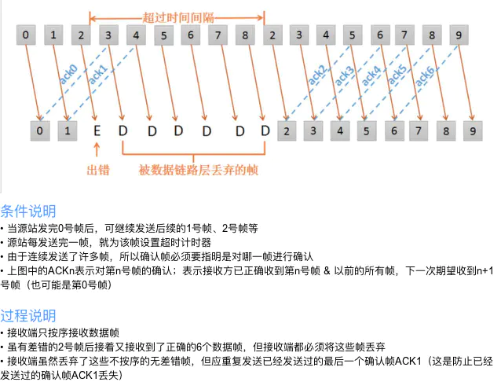

* 类型3：选择重传ARQ（Selective Repeat） *

* 原理
  - 多帧滑动窗口 + 累计确认 + 后退N帧 + 超时重传
> 即 ：发送窗口大小>1、接收窗口大小>1

类似于类型2（后退N帧协议），此处仅仅是接收窗口大小的区别，故此处不作过多描述

* 特点
  - a. 优：因连续发送数据帧而提高了信道的利用率
  - b. 缺：重传时又必须把原来已经传送正确的数据帧进行重传（仅因为这些数据帧前面有一个数据帧出了错），将导致传送效率降低

> 由此可见，若信道传输质量很差，导致误码率较大时，后退N帧协议不一定优于停止-等待协议

**解决方案2：流量控制 & 拥塞控制（针对 速度匹配）**

*措施1：流量控制*

* 简介

* 示例

* 特别注意：死锁问题

*措施2：拥塞控制*

* 定义
  - 防止过多的数据注入到网络中，使得网络中的路由器 & 链路不致于过载
> 拥塞：对网络中的资源需求 > 该资源所能提供的部分

* 与 “流量控制”的区别

* 具体解决方案
  - 共分为2个解决方案：慢开始 & 拥塞避免、快重传 & 快恢复
> 其中，涉及4种算法，即 慢开始 & 拥塞避免、快重传 & 快恢复

#### 解决方案1：慢开始 & 拥塞避免

##### 储备知识：拥塞窗口、慢开始算法、拥塞避免算法

###### a. 拥塞窗口

* 发送方维持一个状态变量：拥塞窗口（cwnd， congestion window ），具体介绍如下

###### b. 慢开始算法

* 原理
  - 当主机开始发送数据时，由小到大逐渐增大 拥塞窗口数值（即 发送窗口数值），从而* 由小到大 *逐渐增大发送报文段

* 目的
  - 开始传输时，试探网络的拥塞情况

* 具体措施

* 示意图

* 特别注意
  - 慢开始的“慢”指：一开始发送报文段时拥塞窗口（cwnd）设置得较小（为1），使得发送方在开始时只发送一个报文段（目的是试探一下网络的拥塞情况）

> 并不是指拥塞窗口（cwnd）的增长速率慢

###### c. 拥塞避免 算法

* 原理
  - 使得拥塞窗口（cwnd）按线性规律 缓慢增长：每经过一个往返时间RTT，发送方的拥塞窗口（cwnd）加1

> 拥塞避免 并不可避免拥塞，只是将拥塞窗口按现行规律缓慢增长，使得网络比较不容易出现拥塞
> 相比慢开始算法的加倍，拥塞窗口增长速率缓慢得多

* 示意图

##### 解决方案1描述（慢开始 & 拥塞避免）

* 为了防止拥塞窗口（cwnd）增长过大而引起网络拥塞，采用慢开始 & 拥塞避免 2种算法，具体规则如下

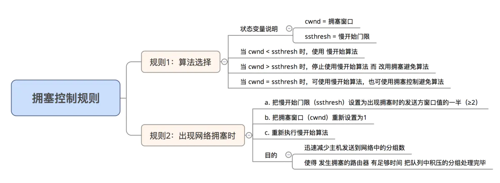

* 实例说明

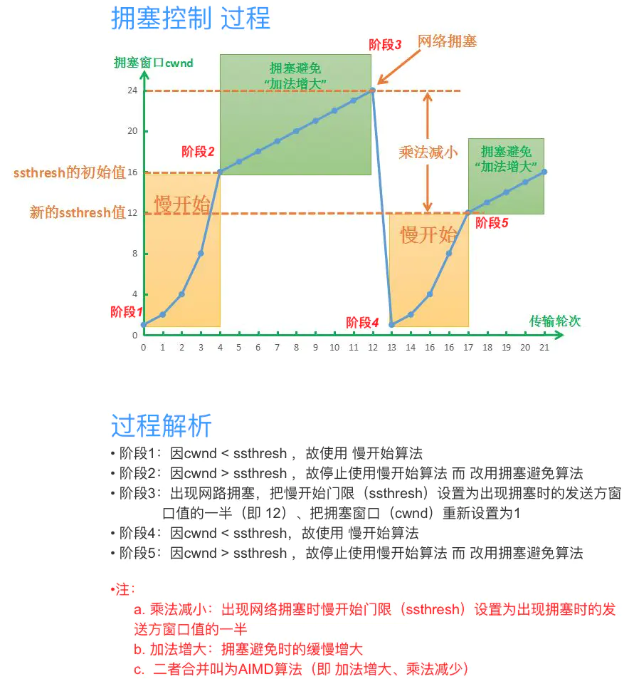

#### 解决方案2：快重传 & 快恢复

快重传 & 快恢复的解决方案 是对慢开始 & 拥塞避免算法的改进

*2.1 储备知识：快重传算法、快恢复算法*

##### a. 快重传算法

* 原理
  - 接收方 每收到一个失序的报文段后 就立即发出重复确认（为的是使发送方及早知道有报文段没有到达对方），而不要等到自己发送数据时才进行捎带确认
  - 发送方只要一连收到3个重复确认就立即重传对方尚未收到的报文段，而不必 继续等待设置的重传计时器到期

* 作用
  - 由于发送方尽早重传未被确认的报文段，因此采用快重传后可以使整个网络吞吐量提高约20%

* 示意图
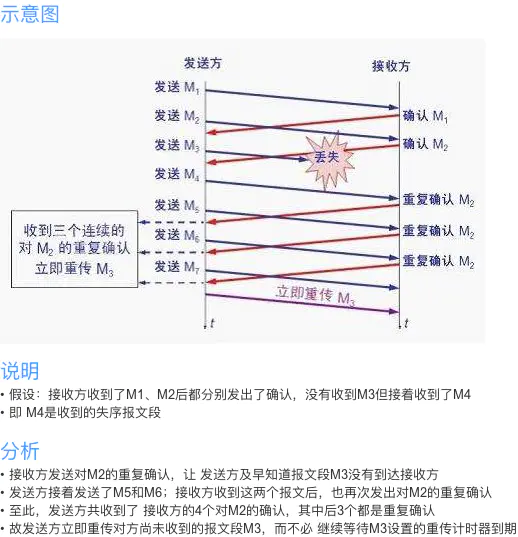

##### b. 快恢复

当发送方连续收到3个重复确认后，就：
  - 执行 乘法减小 算法：把 慢开始门限（ssthresh）设置为 出现拥塞时发送方窗口值的一半 = 拥塞窗口的1半
  - 将拥塞窗口（cwnd）值设置为 慢开始门限ssthresh减半后的数值 = 拥塞窗口的1半
  - 执行 加法增大 算法：执行拥塞避免算法，使拥塞窗口缓慢地线性增大。

> 注：
>
> * 由于跳过了拥塞窗口（cwnd）从1起始的慢开始过程，所以称为：快恢复
> * 此处网络不会发生网络拥塞，因若拥塞，则不会收到多个重复确认报文

##### 解决方案描述（快重传 & 快恢复）

* 原理
  - 为了优化慢开始 & 拥塞避免的解决方案，在上述方案中加入快重传 & 快恢复 2种算法，具体规则如下

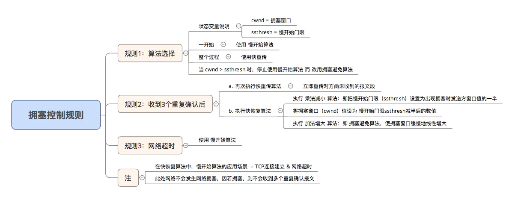

* 示意图

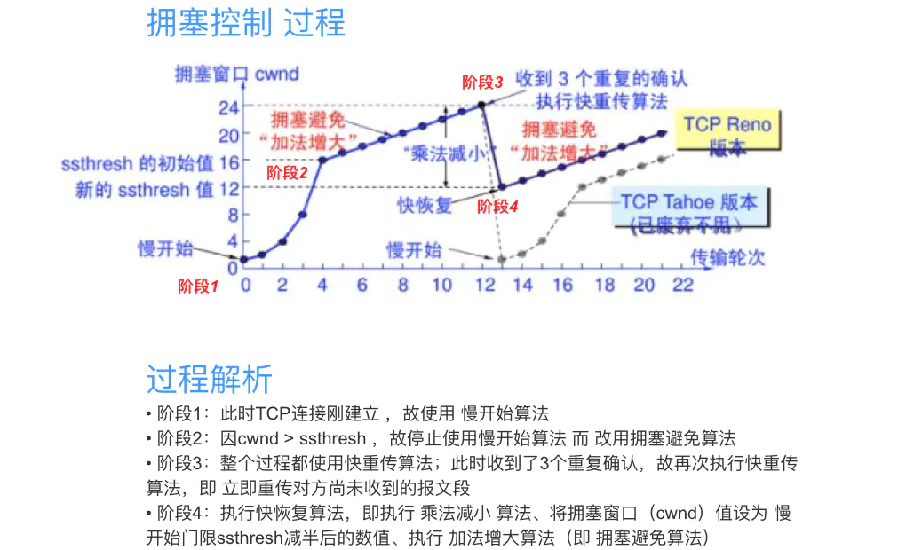

至此，关于TCP无差错传输的知识讲解完毕。
